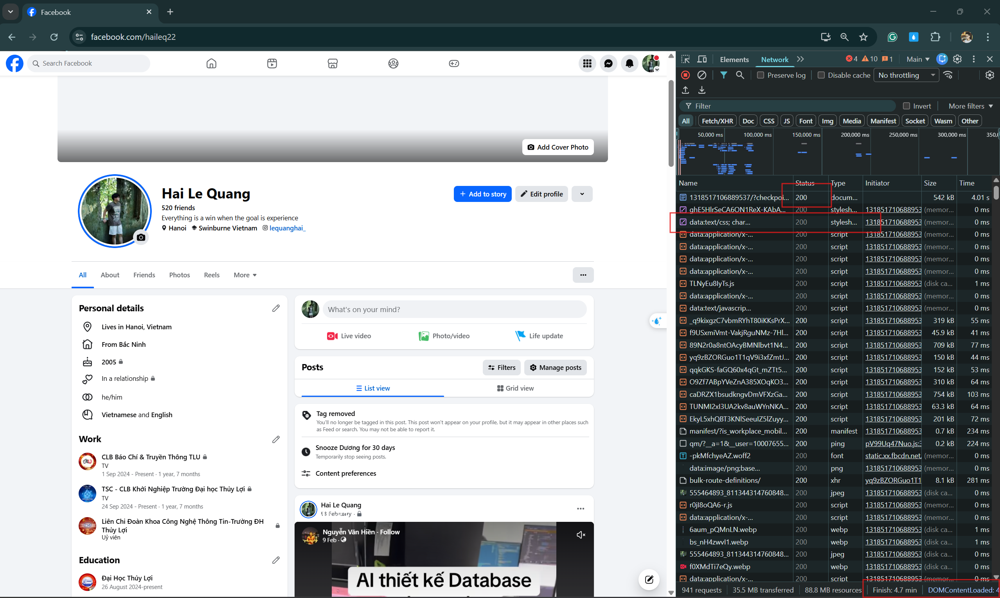

### Câu A1 (5đ) — HTTP & Browser

#### 1. 5 bước xảy ra khi truy cập https://shopee.vn:
1. DNS Lookup: Trình duyệt kiểm tra bộ nhớ đệm (cache) hoặc truy vấn máy chủ DNS để chuyển đổi tên miền `shopee.vn` thành địa chỉ IP của máy chủ.
2. Thiết lập kết nối (TCP & TLS Handshake): Trình duyệt thiết lập kết nối TCP tới server. Vì Shopee sử dụng HTTPS, bước TLS/SSL handshake sẽ diễn ra để mã hóa và bảo mật dữ liệu truyền tải.
3. Gửi HTTP Request: Trình duyệt gửi một HTTP Request (thường là phương thức `GET`) để yêu cầu máy chủ cung cấp nội dung trang chủ.
4. Nhận HTTP Response: Server tiếp nhận, xử lý yêu cầu và trả về HTTP Response bao gồm Status Code (thường là `200 OK`), các thông tin Header và nội dung mã HTML ban đầu.
5. Rendering (Hiển thị): Trình duyệt phân tích HTML tạo DOM Tree, kết hợp với CSS tạo Render Tree, sau đó thực hiện quá trình Layout và Paint để hiển thị giao diện lên màn hình.

#### 2. Tab Network trong DevTools:
* Công dụng: Tab Network cho phép theo dõi toàn bộ quá trình giao tiếp giữa trình duyệt và máy chủ, bao gồm các tệp tin được tải về, trạng thái phản hồi, dung lượng và thời gian tải thực tế của từng tài nguyên.

* Hình ảnh minh họa:

